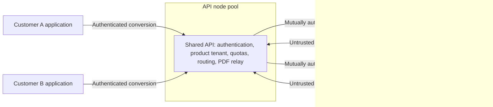

# Hosted renderer design

Status: agreed design, partly built. The shared API is the server's
[gateway mode](engine/server.md#gateway-mode); the
[provisioner](../src/Atli.Reports.Provisioner/README.md) creates, rolls out, and deletes renderers
on Azure Container Apps Sandboxes; both share [`Atli.Reports.Hosting`](../src/Atli.Reports.Hosting).
The [production acceptance gates](#production-acceptance-gates) are not met yet, so no hosted
service runs on them. The default server remains the integrated engine for self-hosted,
application-owned reports. The
[isolated renderer experiment](isolated-workers.md) records why a sandbox launched by the API for
every request is not this design, and holds the measurements behind the numbers below.

A shared public API authenticates callers, resolves product-tenant membership, enforces quotas,
routes each job, and relays the streamed PDF to the caller. It never parses or executes document
HTML. Each customer has its own renderer deployment behind it.

## What a renderer runs

A renderer runs the existing server image in integrated mode: a warm browser, a fresh browser
context per conversion, and Chromium's sandbox on. It accepts conversions only from the API. It
receives document HTML and PDF options, never customer credentials.

The server image runs Chromium's sandbox by default and fails closed where the platform denies the
user namespaces it needs: the browser cannot start, `/health/ready` stays `503`, and the server
never falls back to `--no-sandbox` (see [Chromium's sandbox](security.md#chromiums-sandbox)). The
renderer platform must therefore permit the sandbox:

- **Seccomp.** The container needs [`deploy/seccomp/chromium.json`](../deploy/seccomp/README.md):
  Docker's default profile plus `clone`, `unshare`, and `chroot`, restricted to user, PID, and
  network namespaces. Docker's default profile and containerd's `RuntimeDefault` deny those calls.
  On Kubernetes, install it as a `Localhost` profile on every renderer node, and run renderer pods
  with `hostUsers: false`, as the [Kubernetes example](../deploy/kubernetes/reports.yaml) does.
  Renderer nodes are a pool of their own, so the profile can ship in the node image.
- **AppArmor.** Ubuntu 23.10 and later restrict unprivileged user namespaces through AppArmor.
  Containers under Docker's default AppArmor profile keep Chromium's sandbox there: the
  server-image smoke test passes on GitHub's `ubuntu-24.04` runners with the restriction on, under
  Docker Engine 28.0.4. Pods under containerd's default AppArmor profile were not tested on Ubuntu
  nodes. AppArmor-unconfined pods need the node's `kernel.apparmor_restrict_unprivileged_userns`
  set to `0`.
- **Azure Container Apps** apps cannot apply a seccomp profile. The
  [Bicep template](../deploy/azure/reports.bicep) and the [Aspire guide](aspire.md#deploy) opt out
  of the sandbox there, and whether Container Apps apps permit it without the profile is
  unverified, so a Container Apps app does not meet this requirement yet.
- **Azure Container Apps Sandboxes** do meet it. Each sandbox is a microVM with its own kernel and
  no seccomp filter of the platform's, and the unmodified server image runs Chromium's sandbox
  there; see [Azure Container Apps Sandboxes](#azure-container-apps-sandboxes).

Seccomp filters the whole container, so the profile is not Chromium's alone: the server and the
browser process can also create user and network namespaces with every capability inside them.
That exposes more of the node's kernel to code that has compromised the server or escaped
Chromium's sandbox. Under runc, renderers of different customers share that kernel; see the patch
targets in the [production acceptance gates](#production-acceptance-gates).

## API-to-renderer transport

The API calls a renderer over HTTPS `POST /convert`, the endpoint the server image already serves.
That is not the #152 private protocol, which runs over a worker process's standard input and
output; the server streams a plain chunked HTTP PDF. The hosted API therefore needs its own checks
on every renderer response: a size cap, a deadline, the `%PDF-` prefix, a complete response, and an
aborted client response if the renderer resets or truncates the stream. The #152 gateway
([`WorkerConverter`](https://github.com/atlitech/reports/blob/6f30bffc354394d1866bc68b9f4733f8c3e9cdcd/src/Atli.Reports.Server/Execution/WorkerConverter.cs))
is the model to follow for the output cap, the prefix check, and aborting after the response has
started; its stdio framing does not apply.

## Provisioning and scaling authority

The public API holds no control-plane or deployment rights: it cannot create, modify, scale, or
reassign renderers. Creating a renderer when a customer is onboarded, destroying it, and scaling
it, including from zero, belong to the platform (Azure Container Apps scale rules, or KEDA or
Knative on Kubernetes) or to a separate provisioning service off the request path with narrowly
scoped rights. Any activator or proxy that holds a first request while a renderer scales from zero,
and can reach every renderer, is part of the trusted control plane and falls under the same
separation tests. On Azure Container Apps Sandboxes, waking a suspended renderer needs only a
narrow resume permission; see [Azure Container Apps Sandboxes](#azure-container-apps-sandboxes).

## Separation requirements

- Ingress is internal only and reachable only from the API, apart from the platform's health
  probes to `/health/live` and `/health/ready`.
- Network policy denies renderer-to-renderer traffic and all renderer egress. Documents must be
  self-contained; fetching approved remote assets would need its own design.
- Renderers have no application secrets, no service identity, and no mounted service-account
  token. The only key material a renderer may hold authenticates its own channel to the API (see
  below). Their root filesystem is read-only, with bounded temporary storage.
- Each renderer has CPU, memory, process-count, and ephemeral-storage limits, and renderer nodes
  have eviction thresholds, so one customer cannot exhaust a shared node.
- Renderers run on a node pool separate from the API, enforced with taints and affinity, so a
  kernel escape lands among renderers rather than next to the API's secrets. Such an escape still
  gains the node's own credentials, so renderer nodes carry minimal node identity (image pull
  only), no rights to API or cluster secrets, and restricted access to the cloud metadata endpoint
  where the platform allows. Large customers can have dedicated nodes.
- The API and renderers authenticate each other, each direction separately. The mechanism is an
  [open question](#open-questions-and-next-measurements).
  - A renderer verifies the API without egress, for example with an API-key verifier, a pinned
    public key, or a client certificate. The credential the API presents must be unique to that
    renderer: a distinct API key or token audience per renderer, or mTLS in which the API's
    private key never reaches a renderer. A renderer in API-key mode receives the raw key on every
    request, so a key shared across renderers would let a compromised renderer replay it against
    any other renderer it can reach.
  - The API verifies that it reached the intended renderer, for example through a per-renderer TLS
    server certificate (the renderer may hold that narrowly scoped private key) or through the
    platform's internal addressing.
- The API treats every renderer response as untrusted input; see
  [API-to-renderer transport](#api-to-renderer-transport).
- Renderer logs leave through the platform's standard-output collection, or through one allowed
  egress to a collector that needs no shared secret. The server's OTLP export otherwise needs
  egress and often a collector header. Renderer telemetry is untrusted: label it by deployment
  rather than by attributes the renderer reports, and rate-limit it. Scaling uses API and platform
  metrics.
- Responding to a compromised renderer means destroying it and rotating the credential the API
  presents to it.

## Routing

The API maps the caller's authenticated product tenant to that customer's renderer. If one
credential belongs to several product tenants, a tenant named in the request is only a selector:
the API checks it against the credential's verified membership and rejects it otherwise. The
renderer is always looked up from that verified tenant; it never comes from a request header, a
body field, or a caller-supplied renderer ID. A renderer serves one customer for its entire
lifetime; moving capacity to another customer requires destroying the renderer first.

On Azure Container Apps, apps in one environment can reach each other, and there are no network
policies between them, so egress must be blocked at the VNet level. Renderers that share an
environment depend entirely on each renderer authenticating the API with a per-renderer
credential. Putting each customer's renderer in its own environment removes that dependency; one
shared renderer environment does not. On Kubernetes, the cluster's CNI must actually enforce
NetworkPolicy. These platform properties are design inputs; this repository's tests have not
verified them.

## Scaling and cost

In the [recorded run](../benchmarks/results/2026-10-02-5c500701-isolated-workers-arm64.md), the
warm runc control's cgroup memory peak was 353,558,528 bytes (about 337 MiB, page cache included)
after its first fixture, the invoice, and 906,895,360 bytes (about 865 MiB) after the 49-page
report. A warm renderer's footprint is therefore a few hundred MiB even
for small reports, and its memory limit follows the largest documents a customer sends.

Larger customers keep renderers always on. Small customers can scale to zero and accept a slow
first request. Locally, a fresh runc container returned the invoice PDF 0.26 s after `docker run`
started ([follow-up probes](../benchmarks/results/2026-10-02-b88e5b5-isolation-followup-arm64.md)),
but platform scheduling of a new replica is expected to take seconds. On Azure Container Apps
Sandboxes a suspended renderer resumes with its browser warm instead of starting cold; see
[Azure Container Apps Sandboxes](#azure-container-apps-sandboxes).

## Runtime options per renderer

| Runtime | Boundary between customers | Speed in these probes | Chromium's sandbox |
| --- | --- | --- | --- |
| Plain containers (runc) with Chromium's sandbox | Customers on a node share its kernel. Crossing customers needs a renderer exploit, a sandbox escape, and a kernel or container escape. | Near native; the sandbox added about 30 ms at cold start | On by default in the server image, under [`deploy/seccomp/chromium.json`](../deploy/seccomp/README.md); Ubuntu 23.10+ nodes untested |
| gVisor | Stronger: the renderer's system calls go to gVisor's user-space kernel, not the host's | The long report took 2.3 to 3.1 times as long as under runc in one follow-up run (runc on the host daemon, gVisor nested) and 3.7 times in the recorded run; systrap only | Crashes and then hangs on arm64; amd64 untested |
| Azure Container Apps Sandboxes (Cloud Hypervisor microVMs) | Stronger: each renderer runs its own guest kernel | Near native in [one run](../benchmarks/results/2026-10-03-5b667b4-azure-sandboxes-amd64.md): about 2.0 to 2.1 s for the 49-page report at 2 vCPU, measured in the VM | On, with no profile; see [below](#azure-container-apps-sandboxes) |
| Other microVMs: Kata, Firecracker, or Hyper-V-backed Azure Container Apps dynamic sessions | Stronger: each sandbox runs its own guest kernel | Not measured | A normal guest kernel should support it; untested |

The runc and gVisor rows come from an ARM64 laptop VM; see
[what the measurements show](isolated-workers.md#what-the-measurements-show). The Azure Container
Apps Sandboxes row comes from one region on 2026-10-03; see below. The other platform properties
in this table have not been verified by this repository's tests.

## Azure Container Apps Sandboxes

[Azure Container Apps Sandboxes](https://learn.microsoft.com/en-us/azure/container-apps/sandboxes-overview)
run each sandbox in its own microVM (Cloud Hypervisor, with its own Linux kernel) from a disk image
built from an OCI image or Dockerfile. They can be suspended with their memory and resumed, and
are billed per second while running. The
[recorded run](../benchmarks/results/2026-10-03-5b667b4-azure-sandboxes-amd64.md) put the
unmodified server image in them as a renderer; [`run.py`](../benchmarks/azure-sandboxes/run.py)
reproduces it. A [follow-up](../benchmarks/results/2026-10-04-5d557b4-azure-sandboxes-followup-amd64.md)
tested port authentication, a resume-only role, DNS, concurrent load, and on-demand activation.
What they established:

- **Chromium's sandbox runs.** The microVM has no seccomp filter of the platform's and allows
  unprivileged user namespaces, so the browser starts sandboxed with no profile: no
  `--no-sandbox`, the zygotes in their own user namespace, and the renderer processes under
  Chromium's own seccomp filter. `seccomp-probe.pl` reports every namespace type allowed,
  as expected without a container-level filter: the boundary is the VM, and the kernel those
  calls reach is the renderer's own.
- **Speed is close to native.** Warm conversions measured inside the VM took about 0.04 s for the
  invoice and 2.0 to 2.1 s for the 49-page report at 2 vCPU. Through the platform's port proxy from
  another sandbox in the region, small documents took about 15 to 25 ms longer. A new renderer
  answered `/health/ready` 1.4 to 5.2 s after the create call started, measured from a laptop.
- **Smaller sizes are enough for most documents.** At 1 vCPU and 2 GiB the 49-page report took
  about 2.1 s with a VM memory peak of about 750 MiB, and at 0.5 vCPU and 1 GiB about 2.8 s with a
  peak of about 660 MiB.
- **Throughput tops out at about one conversion per vCPU, and memory is the real limit.** Each
  concurrent 49-page report added about 400 to 500 MiB; at 1 vCPU and 2 GiB, four to eight at once
  got the browser killed for memory. One conversion per vCPU, with one more request queued per
  slot, matched or beat higher concurrency at a fraction of the memory, so renderers run 1
  conversion at 0.5 and 1 vCPU and 2 at 2 vCPU, and admit twice that.
- **A port with on-demand activation wakes its renderer.** With the port's `activationMode` set to
  `OnDemand`, a request to a suspended renderer resumes it and gets its PDF: the invoice in 0.6 to
  1.5 s, the 49-page report in 2.8 to 4.0 s, and every request of a burst during the wake. With the
  default, `Manual`, the request gets `403 {"error":"Sandbox is not running"}`, and an explicit
  resume (1.2 to 1.5 s) comes first. Auto-suspend after an idle period works either way, with the
  browser running. Suspending took 7 to 15 s. Requests the port itself refuses (by source address)
  wake nothing, but on an anonymous port anyone with the URL can wake a renderer before the API key
  is checked.
- **`disable` is a kill switch.** It stops a sandbox and refuses both on-demand wakes and resumes
  until `enable`.
- **Egress is denied at an HTTP proxy, but DNS resolves unless a virtual network blocks it.** With
  `--egress-default Deny`, the platform's egress proxy refuses HTTP and HTTPS to any host and
  records it in the sandbox's egress decisions (with a delay), and other ports are blocked. Name
  lookups, TXT records included, still reach Azure DNS, a channel out in both directions; egress
  rules do not apply to DNS. A sandbox group connected to a virtual network whose network security
  group denies the `AzurePlatformDNS` service tag resolved nothing, and its ports and HTTP egress
  control kept working. The server image did not run in such a group.
- **Every sandbox has a managed-identity endpoint.** It refuses tokens while the sandbox group has
  no identity.
- **Ports take a source-address allow-list, not service tokens.** A port can deny by default and
  allow up to ten rules of source CIDRs. A port limited to Microsoft Entra identities admits only
  browsers through the platform's sign-in; every bearer token tried was refused, a managed
  identity's included, so services cannot authenticate to a port with Entra ID.
- **A resume-only role holds.** A managed identity with only `sandboxes/read` and
  `sandboxes/resume/action` read and resumed a renderer; the 21 other data-plane calls tried,
  stop, exec, files, egress, ports, snapshots, create, and delete among them, were refused. Reading
  a sandbox does not return its environment.
- **Clones of one memory snapshot share the browser's memory layout and environment.** Two
  sandboxes started from a snapshot of a warm renderer had the same browser executable, libc,
  and stack addresses as the original, and the original's environment, credentials included. The
  kernel's random state and boot ID differ per clone.

On Sandboxes the design becomes:

- **One sandbox per customer, never a shared primed snapshot.** A snapshot is only ever resumed as
  the renderer it was taken from. Starting customers from one warm snapshot would give them the
  same address-space layout, weakening ASLR across customers, and the same environment.
- **A separate provisioning service, off the request path, creates and deletes renderers.** It
  holds the *Container Apps SandboxGroup Data Owner* role, which also allows running commands and
  reading files in every sandbox of the group, so nothing on the request path holds it.
- **Renderer ports activate on demand and admit only the gateway's addresses.** The provisioner
  exposes port 8080 with `OnDemand` activation, so the gateway needs no rights over sandboxes at
  all, and limits it to the gateway's outbound addresses, so nobody else can wake a renderer.
  The gateway's `Wake:Mode=Sandboxes` remains for `Manual` ports; its identity then needs only the
  tested resume-only role.
- **`disable` answers a compromised renderer.** The provisioning service disables it at once, then
  replaces it and its credential.
- **Every image release replaces every renderer.** A suspended renderer keeps the browser it was
  suspended with, so the patch target is met only when the provisioning service has recreated
  each renderer from the new disk image, suspended ones included.
- **Renderer sandbox groups have no managed identity.**
- **Each renderer verifies the API with its own credential.** The port URL is public, and ports
  cannot verify a service's Entra token, so the per-renderer API key remains the gate, as the
  [separation requirements](#separation-requirements) already require; the source-address
  allow-list narrows who reaches it. Private ingress through a virtual network was not tested.
- **Renderer sandbox groups that must not leak through DNS connect to a virtual network** whose
  network security group denies `AzurePlatformDNS`. Documents are self-contained, so renderers need
  no name resolution.

Cost, at the consumption rates Sandboxes are billed at (eastus2, 2026-10-03): about $0.216 per
running hour at 2 vCPU and 4 GiB, $0.108 at 1 vCPU and 2 GiB, and $0.054 at 0.5 vCPU and 1 GiB. A
suspended renderer pays only for its snapshot, about 0.2 GB at Premium Blob ZRS rates (about $0.04
a month; Microsoft lists that storage charge as coming soon). A customer whose renderer runs two
hours a day at 1 vCPU costs about $6.50 a month.

## Why Chromium's sandbox alone is not the boundary between customers

- In a hosted service an attacker can simply be a customer. It submits exploit code directly and
  as often as it likes; no victim has to open a page.
- A document can print `navigator.userAgent` into its own PDF and learn the exact Chrome build. The
  exposure window for a public Chrome vulnerability is the time between the Chrome security release
  and the renderer's redeploy.
- Chains of a renderer bug and a sandbox escape are exploited in the wild every year.
- The integrated engine shares one browser process across all conversions. Browser contexts
  separate document storage, not process privilege, so one escape reaches every in-flight document
  in that browser.

Chromium's sandbox is therefore one layer. The per-customer renderer bounds what one escape
reaches, and the runtime and node pool decide how hard the next step is.

## Exception: end users who distrust each other

If one customer's documents come from parties that distrust each other, for example when the
customer lets its own end users upload raw HTML, the trust domain is the end user, not the
customer. That calls for per-job or per-user isolation delivered by the platform, not by the API
shelling out to Docker. This design does not provide it, so it does not cover such customers yet;
how the hosted service handles them is an
[open question](#open-questions-and-next-measurements).

## Production acceptance gates

Before accepting hostile documents in a hosted service:

1. Validate each renderer runtime on the actual deployment platform. From a deliberately
   compromised renderer, test direct network access (other renderers, the API's other endpoints,
   metadata endpoints, the internet), filesystem, identity, process, and control-plane access, in
   addition to normal document policy tests. Verify that Chromium's sandbox is active on the
   actual node image wherever the runtime supports it: no browser process with `--no-sandbox`, and
   renderers outside the browser's user namespace, as the server image's smoke test and Kubernetes
   validation check. Verify resource exhaustion, cancellation, and crash recovery. Runtime canaries
   establish specific controls, not the absence of sandbox vulnerabilities.
2. Introduce authoritative product-tenant membership and routing. Derive the renderer from
   authenticated entitlements, never a request header or caller-supplied renderer ID. Enforce fair
   admission and quotas across API replicas. Authenticate the API-to-renderer channel in both
   directions with per-renderer credentials. Confirm that a renderer rejects every other caller,
   and that a credential captured from one renderer is rejected by every other renderer.
3. Verify separation on the real cluster or environment: enforced network policy (on Azure
   Container Apps, VNet-level egress blocking and the chosen environment layout; see
   [Routing](#routing)), node-pool placement, minimal identity on renderer nodes, per-renderer
   resource limits, and the absence of secrets, identities, and service-account tokens in
   renderers. Verify that a compromised API cannot create, modify, scale, or reassign renderers.
4. Measure on the intended platform and storage: sustained and burst load, cold start of a new
   replica, warm latency, CPU time per report, peak memory per renderer, idle cost, and failure
   rate. Choose always-on and scale-to-zero policies, replica limits, and scaling rules from those
   results; cap total cost and shed load explicitly.
5. Set and meet patch targets, measured from a security release to redeployed renderers, for the
   browser, the renderer nodes' kernel and node image, the container runtime, and the sandbox
   runtime (runsc or Kata) if one is selected. Any document can read the exact browser build, and
   under runc the node kernel is the last layer between customers.
6. Add lifecycle observability and operator recovery without logging HTML, PDF content, credentials,
   or sensitive URLs. Establish incident response, including destroying a compromised renderer and
   rotating its credential, and adversarial tests. Durable asynchronous jobs additionally require a
   durable queue and authorized, expiring storage.

Kubernetes renderer deployments need enforcing network policy on their actual nodes, and a tested
RuntimeClass if a sandboxed runtime is selected. Azure Container Apps' ordinary container profile
is not interchangeable with a dedicated sandbox service; an Azure-specific deployment needs its own
lifecycle and boundary tests. The existing Kubernetes and ACA deployment examples continue to
describe integrated self-hosting; the ACA example opts out of Chromium's sandbox, so it is not a
renderer template.

## Open questions and next measurements

- Decide the tagged-PDF default. It also affects the integrated engine, where Chromium tags unless
  `generateTaggedPdf` is false.
- Test gVisor's KVM platform where `/dev/kvm` exists.
- Test Chromium's sandbox inside gVisor on amd64, and inside microVM runtimes other than Azure
  Container Apps Sandboxes, such as Kata or Firecracker.
- Verify whether Azure Container Apps apps permit Chromium's sandbox without a custom seccomp
  profile, which they cannot apply; until then their template opts out. (Sandboxes do; see
  [Azure Container Apps Sandboxes](#azure-container-apps-sandboxes).)
- On Sandboxes: test private ingress through a virtual network, the server image in a sandbox
  group whose virtual network blocks DNS, and the source address the gateway presents when it runs
  in Azure Container Apps (for the ports' allow-list). Measure the time from an image release to
  every renderer recreated.
- Test Chromium's sandbox on Ubuntu 23.10 and later renderer nodes, with the containerd versions
  the platform runs.
- Choose the API-to-renderer authentication mechanism. It must work without renderer egress or a
  renderer service identity, and the API's credential must be unique to each renderer so that a
  compromised renderer cannot replay it against another. Per-renderer API-key verifiers need
  neither egress nor identity but need per-renderer issuance and rotation; validating the API's
  managed-identity tokens needs signing-key metadata; mTLS needs certificate distribution.
- Decide how the hosted service handles customers whose documents come from end users who distrust
  each other: refuse them, require them to escape or sanitize end-user input as a service term, or
  offer per-user isolation.
- Measure concurrent load on a warm renderer.

Background: [gVisor architecture](https://gvisor.dev/docs/architecture_guide/intro/),
[gVisor compatibility](https://gvisor.dev/docs/user_guide/compatibility/),
[Kubernetes multi-tenancy](https://kubernetes.io/docs/concepts/security/multi-tenancy/), and
[Azure custom container sessions](https://learn.microsoft.com/en-us/azure/container-apps/sessions-custom-container).
