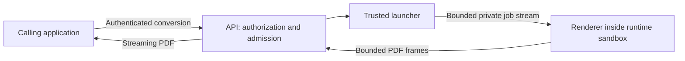

# Isolated renderer experiment

Status: experimental. The default server remains the integrated engine for self-hosted,
application-owned reports. This experiment separates the authenticated HTTP service from a
renderer and measures the cost of a stronger runtime boundary. It is not a managed hosting release.

## Decision and trust boundary

Keep the public `POST /convert` contract and `IHtmlToPdfConverter` interface. An optional execution
backend forwards a bounded job to a private worker. Authentication, permissions, request limits,
and caller identity stay in the API. Workers receive HTML, PDF options, a protocol version, and a
generated correlation ID; they receive no API key, access token, tenant header, or reusable cloud
credential. The correlation ID identifies a response, not an authorized tenant.



The API must treat a compromised worker's response as untrusted input. Frame lengths, protocol
version, job identity, error kinds, output size, completion, and process exit are checked. PDF
bytes stream to the client instead of accumulating in the gateway. A worker failure after the
response starts aborts that response; it cannot become a successful truncated download.

Browser contexts still separate ordinary document state. The outer runtime boundary must contain
a compromised renderer. A separate process alone does not supply that boundary. The development
process backend therefore requires explicit opt-in. The experimental Docker backend requires a
configured sandbox runtime (`runsc` by default); an unavailable runtime must fail instead of
silently selecting ordinary Docker isolation.

Docker workers run without networking, host mounts, a daemon socket, application secrets, or a
service identity. Their root filesystem is read-only, writable temporary storage is bounded, and
CPU, memory, process count, elapsed time, input, output, and concurrent jobs have explicit limits.
Only self-contained assets are supported in this experiment. The integrated engine's asset
allowlist does not enable networking in workers.

The Docker launcher has authority over its configured daemon. In this prototype it runs in the
API process, so compromising that API can compromise the daemon's workload domain. Use a dedicated
test host or daemon; this is not a least-privilege cloud scheduler. A future production worker
agent must narrow that authority and expose authenticated, bounded operations to the API. Never
mount the daemon socket into the renderer or present this prototype as containing an API exploit.

## Selecting the execution backend

Authentication is configured exactly as described in the [security guide](security.md). Execution
settings bind from `ReportsServer:Execution`; environment variables use `__` separators. The mode
defaults to `InProcess`. To select the experiment, use an operator-controlled configuration:

```text
ReportsServer__Execution__Mode=Worker
ReportsServer__Execution__Backend=Docker
ReportsServer__Execution__DockerExecutablePath=/usr/bin/docker
ReportsServer__Execution__Image=<tested-worker-image@sha256:digest>
ReportsServer__Execution__Runtime=runsc
```

The API host must have the Docker CLI at that absolute path and access to a dedicated daemon with
the runtime installed and worker image available. The existing server image does not install the
Docker CLI. These settings alone do not provision a sandbox or convert the ACA/Kubernetes examples
into worker deployments. Build and test the worker image from this checkout; no public worker
image or package is promised by this experiment.

| Execution setting | Default | Meaning |
| --- | --- | --- |
| `MaxConcurrentJobs` | 2 | Active worker slots per API process; saturation returns `Busy` |
| `MaxPdfBytes` | 52428800 | Maximum streamed output bytes per job |
| `Timeout` | `00:01:30` | Worker operation deadline; the request admission deadline can be tighter |
| `CleanupTimeout` | `00:00:05` | Bounded cleanup attempt after completion, cancellation, or failure |
| `MemoryLimitBytes` | 1073741824 | Docker worker memory limit, with swap disabled |
| `CpuLimit` | 1 | Docker CPU limit per worker |
| `PidsLimit` | 256 | Docker process limit per worker |

These are starting budgets, not measured capacity guarantees. The API's body, caller, and global
admission limits still apply. The private protocol additionally caps a serialized request at
16 MiB, a response header at 16 KiB, and a PDF frame at 64 KiB. Increasing HTTP limits cannot
override those protocol limits. Cleanup failure requires operator recovery rather than admitting
more work with uncertain live workers.

`Backend=Process` requires `AllowDevelopmentProcess=true` and an absolute
`ProcessExecutablePath`; `ProcessArguments` are static operator arguments. This mode is for
development and protocol tests and does not contain malicious child processes. Do not put HTML or
credentials in arguments. `EnvironmentVariables` explicitly configures the launched process;
under Docker it configures the trusted CLI and is not forwarded into the renderer container.
Only add settings needed by the launcher or local development worker, never customer credentials.

The worker reads only its explicit operational variables: `ATLI_WORKER_BROWSER_PATH` (an absolute
browser path), `ATLI_WORKER_NO_SANDBOX` (default `false`),
`ATLI_WORKER_DISABLE_DEV_SHM_USAGE` (default `true`), and `ATLI_WORKER_MAX_JOBS` (default 1).
It does not load server appsettings, authentication configuration, or general `ReportsEngine`
environment settings. Input acquisition is limited to 15 seconds, rendering to 90 seconds per
job, and the worker lifetime to 300 seconds, with a separate bounded shutdown attempt. The parent
launcher enforces its deadline independently of the worker's cooperative timers. Disabling the
inner Chromium sandbox in the worker image relies on the separately tested outer runtime boundary.

The launcher supplies Docker's `--init`; the image starts the native worker directly. Its fixed
browser launcher uses `setsid --wait` to put Chromium in a separate session. Actual gVisor testing
caught browser process-tree termination sending SIGHUP to the worker's shared process group after
PDF completion. Separating the browser session preserves clean worker exit without suppressing
signals or accepting a failed exit code. This is lifecycle management, not the sandbox boundary.

## Performance is part of the design

The first gateway backend uses one disposable worker per job with immediate rejection when all
worker slots are occupied. There is no hidden unbounded queue, retry of a partially streamed PDF,
or durable delivery guarantee. The existing integrated mode remains the default while the costs
of disposable workers and reuse are measured.

Compare four cases with identical reports, PDF settings, and resource budgets:

| Case | What it measures |
| --- | --- |
| Warm integrated engine | The server image as it ships, with fresh browser contexts and Chromium's sandbox under [`deploy/seccomp/chromium.json`](../deploy/seccomp/README.md). Runs recorded before the image enabled the sandbox, such as the [ARM64 run](../benchmarks/results/2026-10-02-5c500701-isolated-workers-arm64.md), ran it with `--no-sandbox` |
| Disposable sandboxed worker | Runtime, process, browser startup, and rendering per job |
| Sequential warm sandboxed worker | Rendering with browser reuse inside one explicit trust domain |
| Sequential warm ordinary Docker worker | Same private transport and image, to compare runtime overhead |

The worker's operator-only `ATLI_WORKER_MAX_JOBS` setting permits a bounded sequential reuse
experiment (default 1, maximum 100). The gateway still sends one job and closes its input. This
setting does not create a public worker pool or select tenants. A failed job terminates the worker;
per-job and overall lifetime limits prevent unlimited reuse.

Use the repository's invoice, long-table, asynchronous chart, and embedded-image fixtures. Record
actual page counts and output sizes, warmup policy, sample count, p50/p95 latency, throughput,
errors, runtime and Chrome versions, architecture, and resource limits. Report CPU and memory
where they can be observed, including the limits of the measurement method. A short feasibility
run does not establish a production p95 SLO or peak capacity. End-to-end HTTP and private-stream
measurements have different transport costs and must be labeled accordingly.

No numeric latency or concurrency target has been selected yet. Use measured results and customer
report distributions to set those targets. Favor low allocation and streaming on the gateway,
bounded backpressure, and keeping ready capacity when startup dominates. Do not trade cross-tenant
isolation for a faster benchmark. A future warm pool must assign each worker to one authorized
trust domain for its entire lifetime, with bounded reuse and verified destruction before reassignment.

## Reproducing the experiment

The local harness requires Linux or macOS, Docker, Python 3.12 or newer, and the repository's .NET SDK. It starts
a uniquely named, privileged Docker-in-Docker daemon as trusted test infrastructure, installs a
checksum-verified gVisor bundle there, and removes its owned containers on completion. It does not
change the default Docker daemon's runtime configuration, mount its socket into workers, or expose
a Docker API port. Privileged DinD is a test control plane, not the worker security boundary.

```bash
dotnet build src/Atli.Reports.Server
docker build -f src/Atli.Reports.Worker/Dockerfile -t atli-reports-worker:security .
docker build -f src/Atli.Reports.Server/Dockerfile -t atli-reports-server:security .
python3 -B .github/scripts/smoke-test-worker-gateway-aot.py \
  atli-reports-server:security atli-reports-worker:security
python3 -B .github/scripts/validate-isolated-workers.py --samples 5
```

The first smoke test uses the explicitly enabled development process backend to check NativeAOT
gateway configuration and the private protocol. The second uses real gVisor workers and the
Docker backend. It tests direct containment canaries with a reachable network control, gateway
authorization, PDF completion, policy rejection, disconnects, worker crashes, deadlines, and
missing-runtime rejection. Final results are written only after clean worker exit and teardown.
`--skip-benchmark` runs the latter checks without timings. `--output` changes the JSON result path
(default `artifacts/isolated-worker-results.json`).

The [isolated worker workflow](../.github/workflows/isolated-workers.yml) runs native amd64 and
arm64 image builds and these checks. It publishes no image and deploys no cloud resources. CI's
three samples per fixture are a feasibility check, not a stable performance regression threshold.
Run measurements on an otherwise idle host and retain the image identities, source revision,
limits, sample counts, and measurement caveats with the results.

## Initial measured outcome

The [ARM64 exploratory run](../benchmarks/results/2026-10-02-5c500701-isolated-workers-arm64.md)
completed all 96 conversions. With one CPU and 1 GiB per container, median time for the 49-page
report was 1.57 seconds in the integrated engine, 16.63 seconds in a disposable gVisor worker,
11.36 seconds in a warm gVisor worker, and 3.04 seconds in the equivalent warm runc control.
The warm gVisor worker consumed 66.14 CPU seconds across 24 reports including warmups, compared
with 18.03 seconds for the runc control; those observations exclude final teardown and the gateway.

These results favor retaining the integrated default and treating runtime selection as an open
performance decision. Browser reuse reduces startup cost, but it does not eliminate the observed
gVisor overhead. Before selecting a managed-hosting runtime, compare warm isolated workers on the
intended production storage/runtime and measure sustained concurrent load. The local nested daemon
uses `vfs`, transports differ from the integrated API, and each fixture has only five measured
samples; the reported p95 is a maximum observation, not a production SLO.

## Production acceptance gates

Before enabling hostile documents in a hosted product:

1. Validate the selected runtime on the actual deployment platform. Test direct network, filesystem,
   identity, process, and control-plane access from a deliberately compromised worker, in addition
   to normal document policy tests. Verify resource exhaustion, cancellation, cleanup, and crash
   recovery. Runtime canaries establish specific controls, not the absence of sandbox vulnerabilities.
2. Introduce authoritative product-tenant membership and isolation-aware scheduling. Derive the
   trust domain from authenticated entitlements, never a request header or caller-supplied worker ID.
   Enforce fair admission and quotas across replicas, and authenticate the API-to-agent channel.
3. Measure representative sustained and burst load, startup and warm latency, CPU time per report,
   peak memory, idle capacity, and failure rate. Choose pool size, reuse lifetime, and scaling rules
   from those results; cap total cost and shed load explicitly.
4. Add lifecycle observability and operator recovery without logging HTML, PDF content, credentials,
   or sensitive URLs. Establish runtime/browser patching, incident response, and adversarial tests.
   Durable asynchronous jobs additionally require a durable queue and authorized, expiring storage.

Kubernetes deployments need a tested sandbox RuntimeClass and enforcing network policy on their
actual nodes. Azure Container Apps' ordinary container profile is not interchangeable with a
dedicated sandbox service; an Azure-specific backend needs its own lifecycle and boundary tests.
The existing Kubernetes and ACA deployment examples continue to describe integrated self-hosting.

Background: [gVisor architecture](https://gvisor.dev/docs/architecture_guide/intro/),
[gVisor compatibility](https://gvisor.dev/docs/user_guide/compatibility/),
[Kubernetes multi-tenancy](https://kubernetes.io/docs/concepts/security/multi-tenancy/), and
[Azure custom container sessions](https://learn.microsoft.com/en-us/azure/container-apps/sessions-custom-container).
