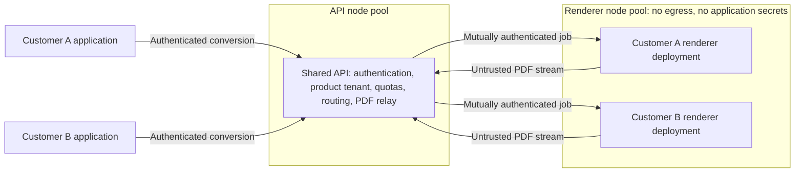
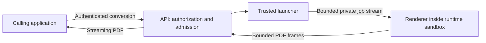

# Isolated renderer experiment

Status: research, frozen. The experiment merged in #152 has the public API launch a fresh gVisor
container for every conversion. It priced the strongest boundary available to it. It is not the
production architecture. The default server remains the integrated engine for self-hosted,
application-owned reports. This page records the decision, the measurements behind it, the hosted
design that replaces the experiment's shape, and how to reproduce the experiment.

## Status and decision

In the experiment, the API process runs `docker run --runtime=runsc` once per request
([`WorkerLauncher.cs`](../src/Atli.Reports.Server/Execution/WorkerLauncher.cs)). That shape is
wrong for production in two ways, and the self-hosted product does not need it:

- **Wrong layer.** Launching containers requires authority over a Docker daemon, which is
  root-equivalent on its host. Compromising the API compromises the daemon's workload domain, so
  the most exposed component holds the most dangerous privilege. Neither Azure Container Apps nor
  Kubernetes gives a container a Docker daemon.
- **Wrong unit.** One sandbox per job is stricter than needed. The boundary that matters in a
  hosted service is between customers. Per-job sandboxes pay sandbox start, browser start, and
  teardown on every request; for one-page reports that dominated the measured time.
- **Not needed for self-hosting.** The [security model](security.md) covers application-owned
  templates and controlled assets, which the integrated engine serves.

Decisions:

1. Self-hosted deployments use the integrated engine; it is the supported mode. The server image
   runs Chromium's sandbox by default. It needs the seccomp profile
   [`deploy/seccomp/chromium.json`](../deploy/seccomp/README.md) and fails closed without it; see
   [Chromium's sandbox](security.md#chromiums-sandbox). Operators who want defense in depth can
   run the same image under a sandboxed runtime, such as a gVisor or Kata RuntimeClass. Under
   gVisor on arm64, Chromium's sandbox crashed in the follow-up probes and the browser then hung
   instead of exiting at startup, which the engine does not report as a sandbox failure. Operators
   there must opt out explicitly (`ReportsEngine__Browser__NoSandbox=true`) and trade one layer for
   the other. The probes used the worker image; the server image under gVisor, and amd64, were not
   tested.
2. A managed service, if one is built, puts a shared API in front of per-customer renderer
   deployments. See [Hosted renderer design](#hosted-renderer-design).
3. Keep the private protocol, the worker binary, the tests, and the benchmark harness from #152.
   Freeze the Docker launcher backend as research; do not extend it.

## What the measurements show

### Initial measured outcome

The [ARM64 exploratory run](../benchmarks/results/2026-10-02-5c500701-isolated-workers-arm64.md)
completed all 96 conversions. With one CPU and 1 GiB per container, median time for the 49-page
report was 1.57 seconds in the integrated engine, 16.63 seconds in a disposable gVisor worker,
11.36 seconds in a warm gVisor worker, and 3.04 seconds in the equivalent warm runc control.
The warm gVisor worker consumed 66.14 CPU seconds across 24 reports including warmups, compared
with 18.03 seconds for the runc control; those observations exclude final teardown and the gateway.
That run predates the server image's sandbox: its integrated engine ran Chromium with
`--no-sandbox`.

These results favor retaining the integrated default and treating runtime selection as an open
performance decision. Browser reuse reduces startup cost, but it does not eliminate the observed
gVisor overhead. The local nested daemon uses `vfs`, transports differ from the integrated API, and
each fixture has only five measured samples; the reported p95 is a maximum observation, not a
production SLO.

### Follow-up findings

The [follow-up probes](../benchmarks/results/2026-10-02-b88e5b5-isolation-followup-arm64.md) ran
on the same ARM64 OrbStack VM with the same image IDs and per-container limits. An ad hoc,
uncommitted client drove the private protocol directly. Values are medians of four or five samples
after one warmup unless the results file says otherwise. They are exploratory, and no CPU, memory,
or p95 figures were measured.

- **Follow-up probes measured much lower warm gVisor times; the gap is unexplained.** A fresh warm
  gVisor worker per fixture on `overlay2` took 4.37 s for the tagged 49-page report (recorded:
  11.36 s), 0.21 s for the chart (0.60 s), and 0.21 s for the invoice (0.29 s). The recorded run
  used `vfs` and ran all four fixtures in one worker, whose cgroup memory peak reached about
  805 MiB of its 1 GiB limit. Later runs on this host drifted by amounts of the same order (see the
  render-time bullet below). The storage driver, sequential reuse near the memory limit, and drift
  are all candidates; none was isolated.
- **Startup and teardown dominate single-use workers.** An empty gVisor sandbox's full lifecycle
  took 0.74 s on `vfs` and 0.26 s on `overlay2`. A single-use gVisor worker finished the invoice
  PDF 1.50 s (`vfs`) or 1.06 s (`overlay2`) after `docker run` started, and its container was gone
  0.29 s or 0.18 s later. A single-use runc worker finished in 0.26 s and was gone at 0.34 s. The
  recorded disposable gVisor p50 was 2.25 s on `vfs`, including the harness's cleanup commands;
  the gateway runs the same `docker rm --force` before it responds.
- **Teardown sits on the response path.** The gateway waits for the worker to exit, which follows
  browser shutdown (a process-tree kill, then profile cleanup), and removes the container before
  `ConvertAsync` returns. The endpoint completes the HTTP response only after that, so the teardown
  tail is client-visible latency and holds a job slot.
- **The storage driver matters.** The harness's nested daemon uses `vfs`, which added about 0.5 s
  to every sandbox lifecycle compared with `overlay2`. Measure on the storage driver production
  would use.
- **Tagged PDFs cost time on long reports.** Under runc, tagging made the 49-page report 7.19 MB
  instead of 0.54 MB and took 1.899 s instead of 1.076 s. Under gVisor it took 4.37 s instead of
  3.36 s. One-page fixtures showed no material difference. The harness and the load benchmark
  always tag, and the integrated engine tags unless a request sets `generateTaggedPdf` to false.
- **gVisor still costs render time on long reports.** In one follow-up run, the 49-page report took
  2.3 times as long under gVisor as under runc tagged, and 3.1 times untagged. The runc probes used
  the host daemon and the gVisor probes a nested one. A later run of the same untagged gVisor
  configuration took 5.04 s instead of 3.36 s, and the next rounds, with more CPU or more memory,
  took 7.67 s and 9.49 s. This laptop VM can neither pin down the ratio nor size CPU or memory
  budgets.
- **The browser process model is not the lever.** Under gVisor, reduced process models
  (`--no-zygote`, `--single-process`, one renderer process without site isolation) shortened a
  cold one-page command-line print from 1.79 s to as little as 1.34 s. They did not materially
  change the long report (7.25 to 7.84 s), and they weaken Chromium's own isolation.
- **Chromium's sandbox is cheap under runc.** Docker's default seccomp profile makes Chrome abort
  with "No usable sandbox!". At the probed revision the server image disabled Chromium's sandbox
  for container compatibility; the worker image relies on the outer runtime instead. With a probe
  profile that allowed `clone`, `unshare`, and `chroot` on top of Docker's default, without
  argument filters, Chrome started with its sandbox and the worker converted every fixture, with
  all other container hardening kept. Five interleaved rounds showed about 30 ms extra at cold
  start and warm differences within noise in both directions. The server image now runs the
  sandbox under [`deploy/seccomp/chromium.json`](../deploy/seccomp/README.md), which limits `clone`
  to user, PID, and network namespaces and `unshare` to a user namespace alone. OrbStack's kernel
  permits unprivileged user namespaces; hosts that restrict them through AppArmor, such as Ubuntu
  23.10 and later, were not tested.
- **Chromium's sandbox crashes inside gVisor on arm64.** Chrome's own seccomp-bpf SIGSYS
  handler crashes on arm64 syscall 123 (`sched_getaffinity`), and the process hangs until killed.
  The worker image's `ATLI_WORKER_NO_SANDBOX=true` is therefore currently required under gVisor on
  arm64, not merely convenient. amd64 was not tested.
- **gVisor's KVM platform was not tested.** OrbStack exposes no `/dev/kvm`; every gVisor number
  here uses systrap.

### Reading the results now

The recorded run's conclusion stands: keep the integrated default. Three parts of its reading
change. First, the recorded gVisor lifecycle and render figures were higher than the follow-up
probes on the same host, but later runs there drifted by amounts of the same order, so neither
set is a stable cost. The warm long-report ratio to runc was 3.7 in the recorded run and 2.3
(tagged, runc on the host daemon, gVisor nested) in one follow-up run. Second, most of the per-job
cost for small reports is sandbox and browser lifecycle, storage driver, and teardown, not
rendering. Warm renderers remove it; a faster per-job launcher would only shrink it. Third, a
gVisor render overhead on long reports appears in every run, but its size is not stable on a
laptop VM and must be measured on the intended platform.

## Hosted renderer design

This is the agreed design if a managed service is built. Nothing in this repository implements it
yet.



A shared public API authenticates callers, resolves product-tenant membership, enforces quotas,
routes each job, and relays the streamed PDF to the caller. It never parses or executes document
HTML. Each customer has its own renderer deployment behind it.

### What a renderer runs

A renderer runs the existing server image in integrated mode: a warm browser, a fresh browser
context per conversion, and Chromium's sandbox on. It accepts conversions only from the API. It
receives document HTML and PDF options, never customer credentials.

The server image runs Chromium's sandbox by default and fails closed where the platform denies the
user namespaces it needs: the browser cannot start, `/health/ready` stays `503`, and the server
never falls back to `--no-sandbox` (see [Chromium's sandbox](security.md#chromiums-sandbox)). The
renderer platform must therefore permit the sandbox:

- **Seccomp.** The container needs [`deploy/seccomp/chromium.json`](../deploy/seccomp/README.md):
  Docker's default profile plus `clone`, `unshare`, and `chroot`, restricted to user, PID, and
  network namespaces. Docker's default profile and containerd's `RuntimeDefault` deny those calls.
  On Kubernetes, install it as a `Localhost` profile on every renderer node, as the
  [Kubernetes example](../deploy/kubernetes/reports.yaml) does.
- **AppArmor.** Ubuntu 23.10 and later restrict unprivileged user namespaces through AppArmor.
  By the kernel and containerd sources, pods under containerd's default AppArmor profile are
  unaffected only with containerd 1.7.31, 2.1.7, 2.2.2, 2.3.0, or later in each line; with older
  containerd the renderer may fail closed, and AppArmor-unconfined pods need the node's
  `kernel.apparmor_restrict_unprivileged_userns` set to `0`. None of this was tested on Ubuntu
  nodes.
- **Azure Container Apps** cannot apply a seccomp profile. The
  [Bicep template](../deploy/azure/reports.bicep) and the [Aspire guide](aspire.md#deploy) opt out
  of the sandbox there, and whether Container Apps permits it without the profile is unverified,
  so a Container Apps renderer does not meet this requirement yet.

Seccomp filters the whole container, so the profile is not Chromium's alone: the server and the
browser process can also create user and network namespaces with every capability inside them.
That exposes more of the node's kernel to code that has compromised the server or escaped
Chromium's sandbox. Under runc, renderers of different customers share that kernel; see the patch
targets in the [production acceptance gates](#production-acceptance-gates).

### API-to-renderer transport

The API calls a renderer over HTTPS `POST /convert`, the endpoint the server image already serves.
That is not the #152 private protocol, which runs over a worker process's standard input and
output; the server streams a plain chunked HTTP PDF. The hosted API therefore needs its own checks
on every renderer response: a size cap, a deadline, the `%PDF-` prefix, a complete response, and an
aborted client response if the renderer resets or truncates the stream. The #152 gateway
(`WorkerConverter`) is the model to follow for the output cap, the prefix check, and aborting after
the response has started; its stdio framing does not apply. Exposing the private protocol over the
network instead would be new work.

### Provisioning and scaling authority

The public API holds no control-plane or deployment rights: it cannot create, modify, scale, or
reassign renderers. Creating a renderer when a customer is onboarded, destroying it, and scaling
it, including from zero, belong to the platform (Azure Container Apps scale rules, or KEDA or
Knative on Kubernetes) or to a separate provisioning service off the request path with narrowly
scoped rights. Any activator or proxy that holds a first request while a renderer scales from zero,
and can reach every renderer, is part of the trusted control plane and falls under the same
separation tests.

### Separation requirements

- Ingress is internal only and reachable only from the API, apart from the platform's health
  probes to `/health/live` and `/health/ready`.
- Network policy denies renderer-to-renderer traffic and all renderer egress. Documents must be
  self-contained; fetching approved remote assets would need its own design.
- Renderers have no application secrets, no service identity, and no mounted service-account
  token. The only key material a renderer may hold authenticates its own channel to the API (see
  below). Their root filesystem is read-only, with bounded temporary storage.
- Each renderer has CPU, memory, process-count, and ephemeral-storage limits, and renderer nodes
  have eviction thresholds, so one customer cannot exhaust a shared node.
- Renderers run on a node pool separate from the API, enforced with taints and affinity, so a
  kernel escape lands among renderers rather than next to the API's secrets. Such an escape still
  gains the node's own credentials, so renderer nodes carry minimal node identity (image pull
  only), no rights to API or cluster secrets, and restricted access to the cloud metadata endpoint
  where the platform allows. Large customers can have dedicated nodes.
- The API and renderers authenticate each other, each direction separately. The mechanism is an
  [open question](#open-questions-and-next-measurements).
  - A renderer verifies the API without egress, for example with an API-key verifier, a pinned
    public key, or a client certificate. The credential the API presents must be unique to that
    renderer: a distinct API key or token audience per renderer, or mTLS in which the API's
    private key never reaches a renderer. A renderer in API-key mode receives the raw key on every
    request, so a key shared across renderers would let a compromised renderer replay it against
    any other renderer it can reach.
  - The API verifies that it reached the intended renderer, for example through a per-renderer TLS
    server certificate (the renderer may hold that narrowly scoped private key) or through the
    platform's internal addressing.
- The API treats every renderer response as untrusted input; see
  [API-to-renderer transport](#api-to-renderer-transport).
- Renderer logs leave through the platform's standard-output collection, or through one allowed
  egress to a collector that needs no shared secret. The server's OTLP export otherwise needs
  egress and often a collector header. Renderer telemetry is untrusted: label it by deployment
  rather than by attributes the renderer reports, and rate-limit it. Scaling uses API and platform
  metrics.
- Responding to a compromised renderer means destroying it and rotating the credential the API
  presents to it.

### Routing

The API maps the caller's authenticated product tenant to that customer's renderer. If one
credential belongs to several product tenants, a tenant named in the request is only a selector:
the API checks it against the credential's verified membership and rejects it otherwise. The
renderer is always looked up from that verified tenant; it never comes from a request header, a
body field, or a caller-supplied renderer ID. A renderer serves one customer for its entire
lifetime; moving capacity to another customer requires destroying the renderer first.

On Azure Container Apps, apps in one environment can reach each other, and there are no network
policies between them, so egress must be blocked at the VNet level. Renderers that share an
environment depend entirely on each renderer authenticating the API with a per-renderer
credential. Putting each customer's renderer in its own environment removes that dependency; one
shared renderer environment does not. On Kubernetes, the cluster's CNI must actually enforce
NetworkPolicy. These platform properties are design inputs; this repository's tests have not
verified them.

### Scaling and cost

In the recorded run, the warm runc control's cgroup memory peak was 353,558,528 bytes (about
337 MiB, page cache included) after its first fixture, the invoice, and 906,895,360 bytes (about
865 MiB) after the 49-page report. A warm renderer's footprint is therefore a few hundred MiB even
for small reports, and its memory limit follows the largest documents a customer sends.

Larger customers keep renderers always on. Small customers can scale to zero and accept a slow
first request. Locally, a fresh runc container returned the invoice PDF 0.26 s after `docker run`
started, but platform scheduling of a new replica is expected to take seconds; that was not
measured.

### Runtime options per renderer

| Runtime | Boundary between customers | Speed in these probes | Chromium's sandbox |
| --- | --- | --- | --- |
| Plain containers (runc) with Chromium's sandbox | Customers on a node share its kernel. Crossing customers needs a renderer exploit, a sandbox escape, and a kernel or container escape. | Near native; the sandbox added about 30 ms at cold start | On by default in the server image, under [`deploy/seccomp/chromium.json`](../deploy/seccomp/README.md); Ubuntu 23.10+ nodes untested |
| gVisor | Stronger: the renderer's system calls go to gVisor's user-space kernel, not the host's | The long report took 2.3 to 3.1 times as long as under runc in one follow-up run (runc on the host daemon, gVisor nested) and 3.7 times in the recorded run; systrap only | Crashes and then hangs on arm64; amd64 untested |
| MicroVMs: Kata, Firecracker, or Hyper-V-backed Azure Container Apps dynamic sessions | Stronger: each sandbox runs its own guest kernel | Not measured | A normal guest kernel should support it; untested |

Only the runc and gVisor rows rest on measurements, and those come from an ARM64 laptop VM. The
platform properties in this table have not been verified by this repository's tests.

### Why Chromium's sandbox alone is not the boundary between customers

- In a hosted service an attacker can simply be a customer. It submits exploit code directly and
  as often as it likes; no victim has to open a page.
- A document can print `navigator.userAgent` into its own PDF and learn the exact Chrome build. The
  exposure window for a public Chrome vulnerability is the time between the Chrome security release
  and the renderer's redeploy.
- Chains of a renderer bug and a sandbox escape are exploited in the wild every year.
- The integrated engine shares one browser process across all conversions. Browser contexts
  separate document storage, not process privilege, so one escape reaches every in-flight document
  in that browser.

Chromium's sandbox is therefore one layer. The per-customer renderer bounds what one escape
reaches, and the runtime and node pool decide how hard the next step is.

### Exception: end users who distrust each other

If one customer's documents come from parties that distrust each other, for example when the
customer lets its own end users upload raw HTML, the trust domain is the end user, not the
customer. That calls for per-job or per-user isolation delivered by the platform, not by the API
shelling out to Docker. This design does not provide it, so it does not cover such customers yet;
how the hosted service handles them is an
[open question](#open-questions-and-next-measurements).

### What to keep from #152

- The private protocol: bounded framing, worker output treated as untrusted, and streaming
  ([`src/Atli.Reports.Worker.Protocol`](../src/Atli.Reports.Worker.Protocol)). The hosted design
  does not carry it over the network; its checks are the model for the API's renderer-response
  checks.
- The worker binary ([`src/Atli.Reports.Worker`](../src/Atli.Reports.Worker)).
- The tests
  ([`tests/Atli.Reports.Engine.Tests/Workers`](../tests/Atli.Reports.Engine.Tests/Workers)).
- The benchmark harness
  ([`validate-isolated-workers.py`](../.github/scripts/validate-isolated-workers.py)) and the
  [isolated worker workflow](../.github/workflows/isolated-workers.yml).

The Docker launcher backend is frozen as research. It remains for reproducing these measurements;
do not extend it or deploy it as a hosting backend.

## Production acceptance gates

Before accepting hostile documents in a hosted service:

1. Validate each renderer runtime on the actual deployment platform. From a deliberately
   compromised renderer, test direct network access (other renderers, the API's other endpoints,
   metadata endpoints, the internet), filesystem, identity, process, and control-plane access, in
   addition to normal document policy tests. Verify that Chromium's sandbox is active on the
   actual node image wherever the runtime supports it: no browser process with `--no-sandbox`, and
   renderers outside the browser's user namespace, as the server image's smoke test and Kubernetes
   validation check. Verify resource exhaustion, cancellation, and crash recovery. Runtime canaries
   establish specific controls, not the absence of sandbox vulnerabilities.
2. Introduce authoritative product-tenant membership and routing. Derive the renderer from
   authenticated entitlements, never a request header or caller-supplied renderer ID. Enforce fair
   admission and quotas across API replicas. Authenticate the API-to-renderer channel in both
   directions with per-renderer credentials. Confirm that a renderer rejects every other caller,
   and that a credential captured from one renderer is rejected by every other renderer.
3. Verify separation on the real cluster or environment: enforced network policy (on Azure
   Container Apps, VNet-level egress blocking and the chosen environment layout; see
   [Routing](#routing)), node-pool placement, minimal identity on renderer nodes, per-renderer
   resource limits, and the absence of secrets, identities, and service-account tokens in
   renderers. Verify that a compromised API cannot create, modify, scale, or reassign renderers.
4. Measure on the intended platform and storage: sustained and burst load, cold start of a new
   replica, warm latency, CPU time per report, peak memory per renderer, idle cost, and failure
   rate. Choose always-on and scale-to-zero policies, replica limits, and scaling rules from those
   results; cap total cost and shed load explicitly.
5. Set and meet patch targets, measured from a security release to redeployed renderers, for the
   browser, the renderer nodes' kernel and node image, the container runtime, and the sandbox
   runtime (runsc or Kata) if one is selected. Any document can read the exact browser build, and
   under runc the node kernel is the last layer between customers.
6. Add lifecycle observability and operator recovery without logging HTML, PDF content, credentials,
   or sensitive URLs. Establish incident response, including destroying a compromised renderer and
   rotating its credential, and adversarial tests. Durable asynchronous jobs additionally require a
   durable queue and authorized, expiring storage.

Kubernetes renderer deployments need enforcing network policy on their actual nodes, and a tested
RuntimeClass if a sandboxed runtime is selected. Azure Container Apps' ordinary container profile
is not interchangeable with a dedicated sandbox service; an Azure-specific deployment needs its own
lifecycle and boundary tests. The existing Kubernetes and ACA deployment examples continue to
describe integrated self-hosting; the ACA example opts out of Chromium's sandbox, so it is not a
renderer template.

## Open questions and next measurements

- Decide the tagged-PDF default. It also affects the integrated engine, where Chromium tags unless
  `generateTaggedPdf` is false.
- Repeat the measurements on a dedicated, idle Linux x86-64 host with `overlay2`, with interleaved
  rounds.
- Add per-phase worker timings: sandbox start, browser launch, load, print, and stream.
- Test gVisor's KVM platform where `/dev/kvm` exists.
- Test Chromium's sandbox inside gVisor on amd64, and inside a microVM runtime.
- Verify whether Azure Container Apps permits Chromium's sandbox without a custom seccomp profile,
  which it cannot apply; until then its template opts out.
- Test Chromium's sandbox on Ubuntu 23.10 and later renderer nodes, with the containerd versions
  the platform runs.
- Choose the API-to-renderer authentication mechanism. It must work without renderer egress or a
  renderer service identity, and the API's credential must be unique to each renderer so that a
  compromised renderer cannot replay it against another. Per-renderer API-key verifiers need
  neither egress nor identity but need per-renderer issuance and rotation; validating the API's
  managed-identity tokens needs signing-key metadata; mTLS needs certificate distribution.
- Decide how the hosted service handles customers whose documents come from end users who distrust
  each other: refuse them, require them to escape or sanitize end-user input as a service term, or
  offer per-user isolation.
- Measure concurrent load on a warm renderer.

## The experiment as built

The rest of this page describes the research code merged in #152.

### Trust boundary

The experiment keeps the public `POST /convert` contract and `IHtmlToPdfConverter` interface. An
optional execution backend forwards a bounded job to a private worker. Authentication,
permissions, request limits, and caller identity stay in the API. Workers receive HTML, PDF
options, a protocol version, and a generated correlation ID; they receive no API key, access
token, tenant header, or reusable cloud credential. The correlation ID identifies a response, not
an authorized tenant.



The API must treat a compromised worker's response as untrusted input. Frame lengths, protocol
version, job identity, error kinds, output size, completion, and process exit are checked. PDF
bytes stream to the client instead of accumulating in the gateway. A worker failure after the
response starts aborts that response; it cannot become a successful truncated download.

Browser contexts still separate ordinary document state. The outer runtime boundary must contain
a compromised renderer. A separate process alone does not supply that boundary. The development
process backend therefore requires explicit opt-in. The experimental Docker backend requires a
configured sandbox runtime (`runsc` by default); an unavailable runtime must fail instead of
silently selecting ordinary Docker isolation.

Docker workers run without networking, host mounts, a daemon socket, application secrets, or a
service identity. Their root filesystem is read-only, writable temporary storage is bounded, and
CPU, memory, process count, elapsed time, input, output, and concurrent jobs have explicit limits.
Only self-contained assets are supported in this experiment. The integrated engine's asset
allowlist does not enable networking in workers.

The Docker launcher has authority over its configured daemon. In this prototype it runs in the
API process, so compromising that API can compromise the daemon's workload domain. Use a dedicated
test host or daemon; this is not a least-privilege cloud scheduler. This authority is why the
shape sits in the wrong layer; the hosted design removes container launching from the API instead
of narrowing it. Never mount the daemon socket into the renderer or present this prototype as
containing an API exploit.

### Selecting the execution backend

The Docker backend is frozen as research. These settings remain for reproducing the measurements.

Authentication is configured exactly as described in the [security guide](security.md). Execution
settings bind from `ReportsServer:Execution`; environment variables use `__` separators. The mode
defaults to `InProcess`. To select the experiment, use an operator-controlled configuration:

```text
ReportsServer__Execution__Mode=Worker
ReportsServer__Execution__Backend=Docker
ReportsServer__Execution__DockerExecutablePath=/usr/bin/docker
ReportsServer__Execution__Image=<tested-worker-image@sha256:digest>
ReportsServer__Execution__Runtime=runsc
```

The API host must have the Docker CLI at that absolute path and access to a dedicated daemon with
the runtime installed and worker image available. The existing server image does not install the
Docker CLI. These settings alone do not provision a sandbox or convert the ACA/Kubernetes examples
into worker deployments. Build and test the worker image from this checkout; no public worker
image or package is promised by this experiment.

| Execution setting | Default | Meaning |
| --- | --- | --- |
| `MaxConcurrentJobs` | 2 | Active worker slots per API process; saturation returns `Busy` |
| `MaxPdfBytes` | 52428800 | Maximum streamed output bytes per job |
| `Timeout` | `00:01:30` | Worker operation deadline; the request admission deadline can be tighter |
| `CleanupTimeout` | `00:00:05` | Bounded cleanup attempt after completion, cancellation, or failure |
| `MemoryLimitBytes` | 1073741824 | Docker worker memory limit, with swap disabled |
| `CpuLimit` | 1 | Docker CPU limit per worker |
| `PidsLimit` | 256 | Docker process limit per worker |

These are starting budgets, not measured capacity guarantees. The API's body, caller, and global
admission limits still apply. The private protocol additionally caps a serialized request at
16 MiB, a response header at 16 KiB, and a PDF frame at 64 KiB. Increasing HTTP limits cannot
override those protocol limits. Cleanup failure requires operator recovery rather than admitting
more work with uncertain live workers.

`Backend=Process` requires `AllowDevelopmentProcess=true` and an absolute
`ProcessExecutablePath`; `ProcessArguments` are static operator arguments. This mode is for
development and protocol tests and does not contain malicious child processes. Do not put HTML or
credentials in arguments. `EnvironmentVariables` explicitly configures the launched process;
under Docker it configures the trusted CLI and is not forwarded into the renderer container.
Only add settings needed by the launcher or local development worker, never customer credentials.

The worker reads only its explicit operational variables: `ATLI_WORKER_BROWSER_PATH` (an absolute
browser path), `ATLI_WORKER_NO_SANDBOX` (default `false`),
`ATLI_WORKER_DISABLE_DEV_SHM_USAGE` (default `true`), and `ATLI_WORKER_MAX_JOBS` (default 1).
It does not load server appsettings, authentication configuration, or general `ReportsEngine`
environment settings. Input acquisition is limited to 15 seconds, rendering to 90 seconds per
job, and the worker lifetime to 300 seconds, with a separate bounded shutdown attempt. The parent
launcher enforces its deadline independently of the worker's cooperative timers. Disabling the
inner Chromium sandbox in the worker image relies on the separately tested outer runtime boundary.
Under gVisor on arm64 that choice is currently forced, because Chromium's sandbox crashes there.

The launcher supplies Docker's `--init`; the image starts the native worker directly. Its fixed
browser launcher uses `setsid --wait` to put Chromium in a separate session. Actual gVisor testing
caught browser process-tree termination sending SIGHUP to the worker's shared process group after
PDF completion. Separating the browser session preserves clean worker exit without suppressing
signals or accepting a failed exit code. This is lifecycle management, not the sandbox boundary.

### Measurement plan

The gateway backend uses one disposable worker per job with immediate rejection when all worker
slots are occupied. There is no hidden unbounded queue, retry of a partially streamed PDF, or
durable delivery guarantee. Worker exit and container removal complete before the response does.

The experiment compares four cases with identical reports, PDF settings, and resource budgets:

| Case | What it measures |
| --- | --- |
| Warm integrated engine | Existing self-hosted baseline with fresh browser contexts |
| Disposable sandboxed worker | Runtime, process, browser startup, and rendering per job |
| Sequential warm sandboxed worker | Rendering with browser reuse inside one explicit trust domain |
| Sequential warm ordinary Docker worker | Same private transport and image, to compare runtime overhead |

The worker's operator-only `ATLI_WORKER_MAX_JOBS` setting permits a bounded sequential reuse
experiment (default 1, maximum 100). The gateway still sends one job and closes its input. This
setting does not create a public worker pool or select tenants. A failed job terminates the worker;
per-job and overall lifetime limits prevent unlimited reuse.

Use the repository's invoice, long-table, asynchronous chart, and embedded-image fixtures. Record
actual page counts and output sizes, whether the PDF is tagged, warmup policy, sample count,
p50/p95 latency, throughput, errors, runtime and Chrome versions, storage driver, architecture,
and resource limits. Report CPU and memory where they can be observed, including the limits of the
measurement method. A short feasibility run does not establish a production p95 SLO or peak
capacity. End-to-end HTTP and private-stream measurements have different transport costs and must
be labeled accordingly.

No numeric latency or concurrency target has been selected yet. Use measured results and customer
report distributions to set those targets. Favor low allocation and streaming on the gateway,
bounded backpressure, and keeping ready capacity when startup dominates. Do not trade isolation
between customers for a faster benchmark.

### Reproducing the experiment

The local harness requires Linux or macOS, Docker, Python 3.12 or newer, and the repository's .NET
SDK. It starts a uniquely named, privileged Docker-in-Docker daemon as trusted test
infrastructure, installs a checksum-verified gVisor bundle there, and removes its owned containers
on completion. It does not change the default Docker daemon's runtime configuration, mount its
socket into workers, or expose a Docker API port. Privileged DinD is a test control plane, not the
worker security boundary.

```bash
dotnet build src/Atli.Reports.Server
docker build -f src/Atli.Reports.Worker/Dockerfile -t atli-reports-worker:security .
docker build -f src/Atli.Reports.Server/Dockerfile -t atli-reports-server:security .
python3 -B .github/scripts/smoke-test-worker-gateway-aot.py \
  atli-reports-server:security atli-reports-worker:security
python3 -B .github/scripts/validate-isolated-workers.py --samples 5
```

The first smoke test uses the explicitly enabled development process backend to check NativeAOT
gateway configuration and the private protocol. The second uses real gVisor workers and the
Docker backend. It tests direct containment canaries with a reachable network control, gateway
authorization, PDF completion, policy rejection, disconnects, worker crashes, deadlines, and
missing-runtime rejection. Final results are written only after clean worker exit and teardown.
`--skip-benchmark` runs the latter checks without timings. `--output` changes the JSON result path
(default `artifacts/isolated-worker-results.json`).

The harness's nested daemon uses the `vfs` storage driver, and the harness requests tagged PDFs.
The first lengthens every sandbox lifecycle and the second lengthens long reports; see the
follow-up findings above.

The [isolated worker workflow](../.github/workflows/isolated-workers.yml) runs native amd64 and
arm64 image builds and these checks. It publishes no image and deploys no cloud resources. CI's
three samples per fixture are a feasibility check, not a stable performance regression threshold.
Run measurements on an otherwise idle host and retain the image identities, source revision,
limits, sample counts, and measurement caveats with the results.

Background: [gVisor architecture](https://gvisor.dev/docs/architecture_guide/intro/),
[gVisor compatibility](https://gvisor.dev/docs/user_guide/compatibility/),
[Kubernetes multi-tenancy](https://kubernetes.io/docs/concepts/security/multi-tenancy/), and
[Azure custom container sessions](https://learn.microsoft.com/en-us/azure/container-apps/sessions-custom-container).
