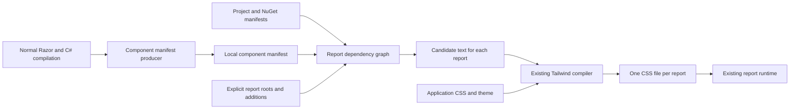

# Tailwind component discovery architecture

Status: implemented as opt-in component discovery, with the remaining roadmap identified below.
The [Tailwind package guide](../src/Atli.Reports.Blazor.Tailwind/README.md) documents the current
consumer API. Manual CSS source declarations remain supported.

Build a dependency graph for each report, collect the Tailwind candidates from its reachable
components, and compile one standalone stylesheet. Use a versioned manifest to connect component
producers and application builds. Keep discovery and Tailwind compilation in the build; deployed
reports continue loading their compiled CSS through the existing runtime API.

The durable decisions are the manifest contract, explicit report roots, conservative discovery,
and predictable build artifacts. The compiler/PDB reconstruction prototype passed the real Razor
fixture corpus and is the implemented extraction backend. The tool was also checked against an
SDK 10.0.201 fixture while built with SDK 10.0.401; future SDK/compiler changes need compatibility
tests before their support is claimed.

## Goals and support boundary

Consumers should declare the report root once and have ordinary nested components followed
recursively, including components in participating project references and NuGet libraries.
Unrelated components should contribute no automatically discovered candidates. Each bundle must
cover all supported conditional branches, including ones absent from a sample render.

This is a conservative set of possible styles for reachable components. It cannot promise the
smallest CSS for a particular request. Tailwind base styles, referenced theme values, explicitly
included sources, and authored CSS can remain in each standalone document. CSS payload reduction
also does not imply an equivalent reduction in the resulting PDF size.

| Usage | Intended support |
| --- | --- |
| Static nested components, qualified names, imports and aliases | Resolve through compiler symbols and follow recursively. |
| Conditional children and loops | Include all statically discoverable alternatives. |
| Generic components | Follow resolved generic helper calls and preserve type arguments until dependencies are resolved; validate substitutions in the prototype. |
| Partial classes and component inheritance | Include relevant declarations and rendering dependencies, with conservative ownership rules. |
| Locally defined `RenderFragment` and template markup | Follow components and literal candidates where the fragment is defined. |
| Complete class strings in component code | Include supported literal expressions and initializers, including conditional alternatives. |
| `DynamicComponent` with a statically known type | Resolve supported constant or finite alternatives. |
| Runtime-selected types, external fragments, reflection and plugins | Require declared possible components or an explicit external styling policy. |
| Classes supplied by external helpers, data or JavaScript | Require explicit candidate sources where discovery cannot establish ownership. |
| Constructed names such as `"text-" + color` | Require complete names or a safelist. |
| Libraries without manifests | Use an explicit source or external CSS policy; report unclassified reachable libraries. |

Dynamic component types can be runtime inputs. An explicit list of possible types is a build
declaration; it does not constrain what the application can instantiate at runtime.
It asserts coverage of all runtime-type selection sites in the declared owner or bundle scope.
[Blazor dynamic components](https://learn.microsoft.com/en-us/aspnet/core/blazor/components/dynamiccomponent?view=aspnetcore-10.0)

Tailwind detects complete names in text rather than evaluating application code. Retain its
`source(none)`, explicit sources, and inline safelists as the underlying source controls.
[Tailwind source detection](https://tailwindcss.com/docs/detecting-classes-in-source-files)

## Consumer configuration

The implementation extends the existing `AtliTailwind` item. Configuration examples below are
implemented; broader CSS-asset export and symbolic generic dependency capabilities remain roadmap
items where identified.

```xml
<ItemGroup>
  <AtliTailwind Update="Reports/Invoice.tailwind.css"
                RootComponent="MyApp.Reports.Invoice" />
</ItemGroup>
```

The report input retains application-owned theme and CSS choices:

```css
@import "tailwindcss" source(none);
@import "../Styles/theme.css";
```

Discovered descendants no longer need individual `@source` declarations. Existing explicit
sources and safelists add to the discovered inputs. The existing runtime registration stays:

```csharp
app.MapBlazorReport<Invoice>(options => options.UseTailwind("Reports/Invoice"));
```

`source(none)` remains necessary for strict source isolation: the component graph does not
disable Tailwind's independent project-wide scan. Explain this in the bundle report and warn
about recognized broader scanning settings, without rejecting layered imports or claiming an
exhaustive analysis of CSS source directives.

An external root is explicit:

```xml
<AtliTailwind Update="Reports/Invoice.tailwind.css"
              RootComponent="Company.Reports.Invoice"
              RootAssembly="Company.Reports"
              BundlePath="Invoices/Standard" />
```

That external bundle is registered with `options.UseTailwind("Invoices/Standard")`.

`RootAssembly` defaults to the current project assembly. Validate the root as a supported
component and fail on missing or ambiguous identities. Retain existing output naming, collision
checks, external input paths, and `BundlePath` behavior. One component may intentionally have
multiple bundles with different themes. An item without `RootComponent` keeps manual source
mode, including its current conservative rebuild behavior.

Provide additions at two scopes:

- A library author can declare extra child components or candidate files owned by a particular
  component. These declarations travel in that component's manifest entry.
- An application can add possible components, candidate sources, or external styling policies to
  one bundle. These additions do not modify a library's manifest or every report in the app.

For example, these component additions supply two possible runtime-selected children to one
report:

```xml
<AtliTailwindComponent Include="Company.Reports.CompactAddress"
                       Assembly="Company.Reports" Bundle="Invoices/Standard" />
<AtliTailwindComponent Include="Company.Reports.FullAddress"
                       Assembly="Company.Reports" Bundle="Invoices/Standard" />
```

An RCL author can attach the same possibilities and extra candidate text to their owning
component instead, so every report reaching it receives those additions:

```xml
<AtliTailwindComponent Include="Company.Reports.CompactAddress"
                       OwnerComponent="Company.Reports.AddressHost" />
<AtliTailwindSource Include="Styles/address-candidates.txt"
                    OwnerComponent="Company.Reports.AddressHost" />
```

An addition must have exactly one scope, `OwnerComponent` or `Bundle`. Reject unknown owners,
unmatched bundle identifiers and unresolved declared component types rather than ignoring them.
Owner-scoped declarations attach to the producer's own components; application overrides for a
referenced library belong to the bundle scope.

Use existing `@source` and `@source inline()` for application source additions and safelists.
Avoid introducing a second class-pattern language. Defer typed `UseTailwind<T>()`, inferred
runtime registrations, and automatic root naming: multiple themes per type and post-compilation
mapping would introduce another runtime contract without helping discovery itself.

## Package and build boundaries

Use two public packages, with shared contracts and isolated analysis kept as internal build tools.

| Boundary | Responsibility |
| --- | --- |
| Existing `Atli.Reports.Blazor.Tailwind` | Application configuration, local manifest production, dependency resolution, report graph traversal, CSS compilation and existing runtime helpers. |
| Build-only `Atli.Reports.Blazor.Tailwind.Discovery` | Let Razor component libraries produce and pack manifests without depending on the report runtime or downloading Tailwind. Authors reference it with `PrivateAssets="all"`. |
| Internal analysis tool | Extract component relationships and candidate fragments. Keep compiler-specific dependencies isolated from MSBuild's own assembly load context. |
| Internal manifest and graph library | Validate manifests, resolve identities, walk dependencies and calculate fingerprints independently of the extraction backend. |
| Existing build task project | Orchestrate artifacts and the pinned standalone Tailwind compiler. |

Producer manifests are passive package data. The application combines the versions selected by
its restore graph. Producers describe their own components and external edges; they do not
flatten referenced libraries into their export. Importing a component package must not activate
Tailwind downloads or application compilation through transitive build targets.
[NuGet build assets](https://learn.microsoft.com/en-us/nuget/concepts/msbuild-props-and-targets)



## Extraction backend

Use post-compilation Roslyn analysis with the actual compiler inputs and Portable PDB source
inventory. Directory globbing cannot establish which generated files belong to the current
compilation; the backend reads the PDB's ordered source inventory instead.

Capture compiler arguments when compilation actually runs, using the SDK's compiler argument
output and compilation hook. Combine that snapshot with Portable PDB source checksums, embedded
generated text, and reference identities. Resolve original sources and references locally, then
construct a Roslyn compilation for analysis without rerunning generators or analyzers. Public compiler
argument and metadata APIs implement this without a dependency on Roslyn's internal rebuild
tool. Required snapshots participate in normal compiler output invalidation.

Validate PE/PDB identity, original-source checksums, reference MVIDs and aliases, and relevant
compiler feature options. Missing or mismatched data fails reconstruction; a same-name reference
assembly is insufficient. The extraction tests exercise changed source, options, references,
symbol identity, path mapping and stale generated files.

The integration uses `ProvideCommandLineArgs`, `CscCommandLineArgs` and
`CustomAdditionalCompileOutputs`. It captures arguments after `CoreCompile` when the compiler
returned them, and retains validated snapshots for skipped compilations. Compiler implementation
also shows generated source embedding; verify the matching PE/PDB pair and original source
inventory rather than assuming every PDB document is an original compilation input.
[Roslyn compiler implementation](https://github.com/dotnet/roslyn/blob/main/src/Compilers/Core/Portable/CommandLine/CommonCompiler.cs)

Portable PDBs contain compilation options and reference information intended to support
reconstruction and post-build analysis. That makes this a promising input contract, subject to
verifying the actual Razor-generated source inventory in supported SDKs.
[Portable PDB compilation information](https://github.com/dotnet/roslyn/blob/main/docs/features/pdb-compilation-options.md)

Both portable and embedded Portable PDB variants are exercised in Debug and Release. For discovery
producers using `DebugType=None`, report the required build setting or retain the existing manual
source workflow. Do not silently change debug settings, fetch sources from symbol servers, execute
component code, or downgrade to partial discovery. Consumers of a packaged manifest need no PDB
or original source files.

| Alternative | Decision |
| --- | --- |
| A source generator alongside Razor | Cannot consume Razor's generated output in the same invocation. |
| A diagnostic analyzer writing manifests | Can inspect compiler state, but reliable build artifact emission is not its diagnostic output contract. Reserve analyzers for optional diagnostics. |
| Parse Razor tags or use Razor compiler internals | Duplicates resolution rules or couples the package to private compiler phases. |
| Read persisted `.g.cs` files alone | Does not establish exact references, source membership or options; stale files can survive. |
| Analyze implementation IL | Credible alternative spike if semantic replay fails. Must prove generic helper, closure, field initializer and candidate ownership behavior. |
| Compile CSS from rendered HTML per request | Adds deployment tooling, compilation latency and request-dependent caches. A sample render also omits other conditional states. |

Source generators see the same input compilation and cannot consume one another's generated
files. Keep this distinction explicit when evaluating future compiler integration.
[Roslyn source generator contract](https://github.com/dotnet/roslyn/blob/main/docs/features/source-generators.md)

Use bounded discovery rules rather than attempting arbitrary C# program analysis:

1. Resolve component symbols and all their partial declarations. Associate generated methods,
   local functions, closures and generic inference helpers through symbols and call relationships.
2. Discover recognized `RenderTreeBuilder` component calls, relevant base components and explicit
   additions. Follow the supported static helper paths needed by ordinary Razor output.
3. Collect decoded string and markup fragments from component-owned declarations and supported
   initializers. Keep complete literal alternatives. Preserve arbitrary values and escaping when
   serializing and reconstructing scan text.
4. Associate shared helper fragments only through proven ownership or explicit declarations.
   Including every string in a shared assembly would defeat per-report isolation.
5. Record unsupported dynamic component edges and extraction gaps. Arbitrary data-driven utility
   names cannot all be detected or diagnosed; the support contract must say so.

Preserve generic substitutions until affected edges are resolved, then normalize stable component
identities. Ordinary model generics such as `Table<Row>` are in the initial corpus. A generic
parameter that itself determines a component type needs explicit alternatives if it cannot be
resolved. Symbolic generic dependencies across manifests are a later capability, not an implied
guarantee of schema version 1. Bound recursive generic expansion as well as ordinary graph cycles.

Keep Tailwind responsible for recognizing valid utilities. The implementation exports candidate
fragments from rendered class contexts, with bounded traversal of referenced component-owned
fields, properties and return helpers. Static class dictionaries and attribute splats are covered.
Ordinary text, non-class HTML attributes and unused private members are excluded. Component string
parameters are conservatively included because custom parameters can supply a child's classes.
Mutable dictionaries and external class providers still require declared sources. Escaping and
arbitrary-value tests protect the candidate round-trip.

Roslyn reconstruction is the single implemented backend. IL remains a possible future alternative
if compatibility evidence warrants it; there is no silent fallback to less complete discovery.

## Manifest contract and resolution

The portable manifest is versioned independently of extractor implementation. This abbreviated
schema illustrates the implemented contract:

```json
{
  "schemaVersion": "1.0",
  "requiredCapabilities": ["component-graph-v1", "candidate-fragments-v1"],
  "producerVersion": "1.0.0",
  "artifact": {
    "assemblyName": "Company.Reports",
    "targetFramework": "net10.0",
    "implementationSha256": "<sha256>"
  },
  "components": [
    {
      "typeName": "Company.Reports.Invoice",
      "dependencies": [
        { "assemblyName": "Company.Reports", "typeName": "Company.Reports.Header" }
      ],
      "candidateFragments": ["text-brand print:break-inside-avoid"],
      "unresolved": []
    }
  ]
}
```

The contract includes assembly identity, metadata type names including nested types and generic
arity, selected TFM/RID, artifact hashes, declared additions, unresolved edges and relative
diagnostic locations. Component payloads determine graph fingerprints. Known empty entries
distinguish an empty candidate set from an absent manifest entry. CSS-asset export identities are
reserved for a later schema capability; current themes and extra CSS are application-managed.

Store JSON-escaped text as data. Decode it into generated plain-text scan inputs; do not scan the
JSON itself or convert arbitrary text into an executable `@source inline()` expression. Pack no
machine-specific paths or required references to the producer's source tree.

Resolve manifests from the current project, declared project-reference outputs, and the restored
NuGet dependency graph, including transitive packages. Match the chosen assembly and TFM/RID,
rather than scanning the whole NuGet cache or guessing a `bin/Debug` path. Bind manifests to
implementation artifacts. Reference assemblies can support semantic binding but omit method
bodies and cannot supply implementation discovery.
[Reference assemblies](https://learn.microsoft.com/en-us/dotnet/standard/assembly/reference-assemblies)

The producer output-query target `GetAtliTailwindManifest` returns the known artifact for the
selected project configuration without initiating compilation. Project outputs advertise a
`<assembly>.dll.atli-tailwind.json` sidecar. NuGet exports live under
`atli-tailwind/v1/<tfm>/`, with an `index.json` mapping implementation assets to manifests. The
resolver uses restored package assets and selected implementation references; it does not scan
the entire package cache.

Validate hashes against the selected implementation artifact before publish transformations.
Trimming and ReadyToRun may change the published DLL bytes; do not compare those transformed
files directly with producer hashes.

Reject incompatible schema majors, unsupported required capabilities, ambiguous identities and
mismatched artifacts. Compatible optional fields may be ignored. Future CSS exports can declare a
Tailwind compatibility requirement; validate against the application's pinned compiler without
upgrading it automatically. A candidate-only producer should not unnecessarily pin the exact
Tailwind patch used by an application.

Traverse dependencies with cycle detection and deterministic ordering. Deduplicate components
inside each report. Retain a path explaining why each component was included. Do not require
every library in a solution to be reachable or every component to be a report root.

## CSS ownership and external dependencies

The application owns the root CSS, Tailwind theme and import order. Library candidate fragments
provide possible utility usage; they do not silently select colors, merge themes or install
plugins. Current library CSS and theme imports are application-managed. A future asset-export
capability can declare component CSS and theme defaults, with explicit import mappings and
diagnostics for missing mappings.

Keep authored CSS and `@apply` rules at their declared asset boundary. The component graph does
not tree-shake arbitrary CSS. Preserve relative imports when staging package assets, and define
font/image URL handling before promising portable asset exports. The initial discovery release
can require application-managed imports while the broader asset protocol remains deferred.

Blazor `.razor.css` isolation is a separate pipeline with generated scope selectors and bundled
assets. Discovery does not automatically make raw isolated CSS usable inside standalone report
HTML. Integrating the SDK's scoped output, and pruning that output, need a separate design.
[Blazor CSS isolation](https://learn.microsoft.com/en-us/aspnet/core/blazor/components/css-isolation?view=aspnetcore-10.0)

For an unclassified external component, `AtliTailwindExternal Policy="SelfStyled"` declares that
its styling is handled externally. Consumers can supply candidate sources or prebuilt CSS through
their authored inputs. Framework primitives have a small built-in policy. Do not assume arbitrary
third-party libraries use Tailwind or silently ignore an unresolved Tailwind-aware dependency.

An external-styling declaration resolves the coverage warning for its scope; it does not fetch,
inline or validate CSS automatically. Prebuilt CSS contributes the imported asset in full.

During preview, unresolved reachable components warn by default and a strict setting promotes
them to errors. A selected root without a usable manifest fails with manual-source fallback
instructions. A participating library's advertised manifest being absent, corrupt, incompatible
or mismatched also fails. Invalid roots and missing explicit CSS imports fail; an unclassified
ordinary third-party descendant receives the aggregated preview warning instead.
Show the bundle, dependency path, location when available, and the exact declaration needed.
Explicitly classified external styling resolves the warning. Diagnostic defaults can tighten
only through a documented compatibility change.

Generate an explain artifact under the intermediate directory containing roots, dependency
paths, manifest producer/schema versions, external component paths, unresolved coverage, candidate
count and rebuild reasons. Declared component additions are identified in dependency paths.
`AtliTailwindExplain` locates these artifacts. A richer inventory of explicit source declarations
and output-size statistics can be added later. The runtime does not need the explanation.

## Build lifecycle and invalidation

The current `AtliCompileTailwind` runs before `BeforeBuild`. Automatic discovery requires
separating output declaration from byte generation:

1. Resolve configuration, TFM and RID-specific paths and declare expected CSS content before
   `AssignTargetPaths`. Explicit CSS inputs provide the output inventory on a clean build.
2. Let normal project-reference, Razor and C# compilation run. Capture compiler inputs only when
   actual compilation runs; retain a validated snapshot for skipped compilations. A precompile
   freshness check must force one normal compilation through supported MSBuild inputs when a
   required snapshot is missing, or fail with explicit rebuild guidance. Invalidating discovery's
   cache alone cannot recreate skipped compiler arguments.
3. Produce or validate each project's manifest after compilation. Test enabling discovery on an
   already-built project and deleting only its snapshot. Neither may reuse a stale manifest.
4. Resolve dependency manifests, build each root's closure and generate candidate text. Compile
   CSS before normal output copying, including when C# compilation itself was skipped.
5. Commit the successful artifact inventory after required outputs exist. Publish reads only a
   matching successful inventory, preventing a new assembly from using stale graph-derived CSS.

Persist unresolved coverage in that inventory. No-build pack and publish operations enforce the
current strictness policy against the saved status without rerunning analysis. A warning-producing
build must not later be presented as fully validated merely because compilation was skipped.

Test the exact targets against the supported SDK. Moving the existing task wholesale to
`AfterBuild` does not establish content discovery or publish correctness. Preserve CSS import
and `@source` relativity when constructing a generated wrapper input; never rewrite user files.

| Operation | Required behavior |
| --- | --- |
| Build | Produce matching manifests and bundles; preserve output timestamps when bytes do not change. |
| Pack | Include producer manifests and declared assets for each packed TFM, bound to the final packaged assembly. |
| `pack --no-build` | Require matching existing producer outputs; fail clearly on missing or stale artifacts. |
| Publish | Copy runtime CSS through the existing paths. Build-only manifests, tools and compiler dependencies stay out of runtime deployment. |
| `publish --no-build` | Validate and copy a successful build for the same configuration, TFM and RID; invoke neither discovery nor Tailwind. |
| Clean | Remove recorded owned intermediates and copied outputs, including removed roots; preserve the shared compiler cache. |
| Watch | Use the SDK's component inputs plus CSS and named `AtliTailwindSource` files to trigger normal builds. Retain the documented `--no-hot-reload` workflow. Arbitrary external sources may need explicit `Watch` items; generated manifests are not watched. |
| Design-time build | No tool acquisition, component extraction or CSS compilation. |
| Multi-targeting | Run producer and bundle work in the selected inner build with isolated paths. |
| Parallel and static graph builds | Respect project dependencies; avoid hidden recursive builds and process-wide serialization. |

If weaving or another post-compilation step changes an implementation assembly after extraction,
packing must fail or regenerate discovery from the final compatible inputs. Updating only the
stored hash would incorrectly certify a potentially stale graph. Known publish transformations
such as trimming are separately tracked from the source build artifact used for validation.

Use content fingerprints for:

- Producer inputs: extractor/schema versions, exact compilation identity, relevant sources and
  membership, references/options, and explicit component declarations.
- Bundle inputs: root and overrides, reachable component payloads and edges, ordered CSS/theme
  assets, source membership, compiler identity/version/options, and target configuration.

Track additions and removals as well as modified contents. Recompute closures when edges change.
The implementation recomputes root closures and fingerprints so shared-component changes
invalidate dependent reports. A persistent reverse dependency index is an optional future optimization.
Assembly hashes validate provenance; unchanged per-component payloads should eventually allow
unaffected bundles to remain cached when another component in that assembly changes.

Write outputs atomically and record successful hashes last. Prune only previously recorded owned
files. A failed build must not mark stale CSS as current. Unknown import, plugin or source
dependencies disable unsafe skipping; retain conservative rebuilds instead of relying on a
partial home-grown CSS dependency parser.

The implemented CSS skip path is deliberately bounded: an input containing only the exact
`@import "tailwindcss" source(none);` statement (either quote style) has no extra CSS dependencies,
so its graph/compiler/output fingerprint can safely skip Tailwind. Inputs with theme imports,
additional sources or other directives continue compiling conservatively. Producer manifests
are cached independently. Expanding CSS dependency tracking remains a roadmap item.

## Delivery phases and acceptance gates

| Phase | Deliverable | Gate before proceeding |
| --- | --- | --- |
| 0 | Extraction and scan-text prototype; compiler snapshot experiment | Exact current generated-source inventory, supported static relationships and candidate round-tripping demonstrated in Debug and Release; backend decision recorded. |
| 1 | Local graph mode, explicit additions, diagnostics and explain artifact | Static descendants included, unrelated sibling utilities absent, manual mode unchanged, clean build/publish ordering correct. |
| 2 | Producer package, versioned manifests, project and NuGet resolution | Source-free packed-library consumption, transitive dependency selection, TFM correctness, schema mismatch errors, `pack --no-build` validation. |
| 3 | Watch, failure recovery, clean/publish integration and compatibility matrix | No stale bundles after deletions/failures; parallel and static graph builds correct; no runtime compiler dependency. |
| 4 | Proven incremental skipping and measured performance | Unchanged builds launch neither extractor nor Tailwind; unrelated component edits do not recompile unaffected bundles; uncertain dependencies still rebuild. |

Phase 0 compares the preferred backend with a hand-declared reference graph and CSS inputs.
Include deep nesting, namespace collisions, aliases, generic inference helpers, nested templates,
partials, inheritance, shared helpers, static initializers, cycles, finite dynamic types and
unresolved runtime types. Add variants, arbitrary values, escaped content, raw strings and
literal dictionaries. Removed generated files and stale snapshots must never add old candidates.
If compiler replay misses these cases or requires private APIs, resolve that before publishing
the manifest format.

The validation layers are:

| Layer | Required evidence |
| --- | --- |
| Graph and manifest contracts | Stable identities, cycles, ownership, known-empty components, schema evolution, declared additions and useful unresolved-edge diagnostics. |
| Real compiler fixtures | Supported Razor idioms across the pinned .NET 10 SDK and declared supported feature bands; Debug/Release and portable/embedded symbols. |
| Actual Tailwind compilation | Nested utilities present and unrelated report utilities absent; exact arbitrary-value/variant semantics survive serialization. |
| Packed consumer tests | Consumer outside this repository with isolated caches; direct/transitive RCLs, source-free packages, relocated paths and matching selected assets. Project-reference and NuGet consumption must produce equivalent graph payloads and CSS for the same selected inputs. |
| Lifecycle tests | Build/pack/publish/clean, both no-build modes, custom intermediate/output paths, configuration and TFM changes, deletion, cancellation, partial failure and concurrent builds. |
| Browser integration | Real report rendering checks computed styles for nested and generic children, shared theme values, distinct conditional states and declared dynamic alternatives before PDF completion. Assert print behavior under controlled print media. |
| Deployment test | Published app renders from another working directory without source, manifests, analyzer or compiler access. |
| Platform matrix | Windows, Linux and macOS for package/build behavior; a real browser gate on the supported CI browser platform. |

Extend the [existing packed consumer suite](../tests/Atli.Reports.Tailwind.Tests/README.md).
Keep its manual-source cases as regression tests rather than replacing them with graph cases.
Use isolated process fixtures to count tool invocations and verify invalidation directly.

Benchmark 10, 100 and 1,000 components with both shared and independent report graphs. Record
cold and warm build time, analyzer time and peak memory, unchanged build overhead, a shared-child
edit, and an unrelated-component edit. Set performance budgets from that baseline before stable
release. Equivalent logical inputs must produce
identical normalized graph payloads and CSS across relocated checkouts. Require byte-identical
complete manifests when the compiler artifacts are also identical, using deterministic path
mapping for that test. Assembly fingerprints may legitimately differ with path-dependent compiler
output; that does not excuse machine-specific paths in distributable manifest fields.

An implementation sanity run on the local macOS host with SDK 10.0.401 produced the following
results. It used real Release Razor compilations and portable PDBs; restore was excluded from
compile time, while extraction includes process startup. Each root reached half the components,
including a shared child referenced by multiple descendants.

| Total components | Compile | Extract | Graph resolution | Reachable components |
| ---: | ---: | ---: | ---: | ---: |
| 10 | 1.210 s | 0.340 s | 8.6 ms | 5 |
| 100 | 0.936 s | 0.413 s | 10.8 ms | 50 |
| 1,000 | 5.013 s | 0.922 s | 10.1 ms | 500 |

Every expected closure and candidate count matched, shared children appeared once, and unrelated
components were excluded. Graph timings exclude JSON loading and helper-process startup. These
single runs check scaling sanity; they are not a performance guarantee or a substitute for the
pinned-runner baseline above.

## Risks and deferred work

The highest risks are exact compiler-input recovery, attribution of generic/template helper
code, and serialization of Tailwind candidates. They belong in Phase 0. Project/restore asset
resolution and build ordering follow before incremental optimization. Build diagnostics must
make incomplete coverage visible without treating every ordinary component library as broken.

Runtime compilation, executing sample reports during builds and inferring arbitrary runtime
registration code are outside this architecture. Defer Hot Reload integration, automatic analysis
of unmanifested NuGet assemblies, typed runtime bundle lookup, automatic theme conflict resolution,
scoped CSS pruning and Node-based custom plugin provisioning. Those enhancements can evolve
behind the manifest and build boundaries once consumer evidence justifies them.

Proceed with the contracts above and the extraction prototype first. Existing manual sources
remain supported throughout rollout, and the automatic support matrix grows only when the
compiler, package and browser fixtures demonstrate it.
